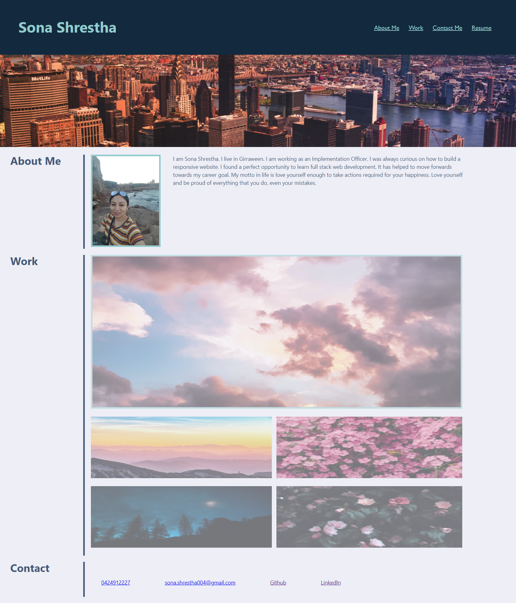
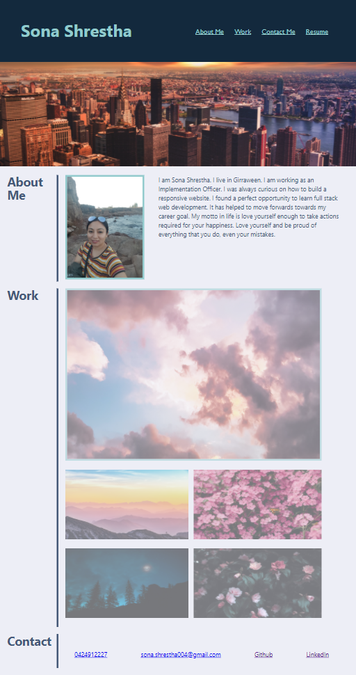
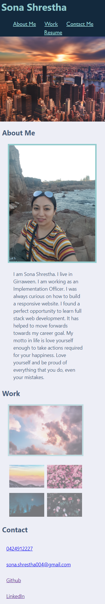

# 02 Advanced CSS : Portfolio

- This assignment was done to learn how to build a responsive portfolio webpage using flexbox and media queries.
- The website contains my name, recent photo and links to sections about me, my work and how to contact me.
- When the navigation links are clicked, the UI scrolls to corresponding section.
- when clicking on the images in the work section, then links to corresponding projects.
- The footer links contains ways to contact me
- The resume can be downloaded from Resume header navigation.

## Technolgy used:

HTML, CSS, Flexbox

## Mock up

- The following image shows the web application's appearance in different devices

## Desktop

## Ipad pro

## Iphone X

## Link to deployed application

https://sona29.github.io/first-assignment/
